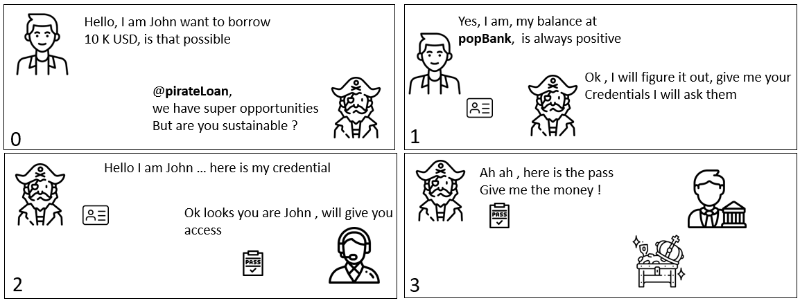

# Authorization CodeFlow

## Context , usage , purpose 

### Scenario 

> The challenges , is how do I to grant access to a 3rd party to my data owned.

here is one solution 

Here as John gives its credential to PirateLoan , PirateLoan has then full access to his bank, it s definitely not a good solution. 

Topic is now to be able to share an 'scoped' access to a specified 3rd party , in a secure maner. 
Authorization code flow solves this by introducing a trust and authorization party. 

> Solution is based on bi mutual trust : 
> * End user must have access to the data owner (here bank)  via a secret (login / password ) 
> * 3rd party (here coolLoan ) must be registered to data owner (bank) via a client id / secret for a given scope  
> * End user knows both party bank and cool loan and allows exchange of information for a given scope for doing that he must be known (ie logged)

Notice that most of the time the *identity provider* and the *provider 

### Mapping with OpenIdConnect Authorization Code flow.  

In the last comics here is a mapping with the openID connect concept

* John is the resource owner : he is the one who owned the resource here an account . He uses a User agent
* CoolLoan is the 3rd party called the Client.
* CoolLan has pre registered an application in popBank. it is about a clientId (public), a clientSecret as well as a redirect url 
* Otto is the AuthorizationServer, it contains usually and Identity server (called IdP) that allows John to Authenticate himself , and grant permission. 
* Boris is the Access Token provider. it need to know Otto. Most of the time the Authorization Server
* During step 1, CoolLoan is providing a *state*
* During step 2&3 the User agent send the state + the callback URI + a *code* + clientId . CallBack URI need to be the same as the registered one (notice that several can be registered). it is a weak identification of coolLoan. the code has a short expiration time 
* During step 4 Auhtorization will send back to John the state , as well with the a code. The key aspect is that it redirect to a coolLoan registered URL . So here there is trust between authorization server, user , client. 
* Step 5 corresponds to the redirect following the uri. Client validate that the state is the one it sent at the beginning. and will use the code   
* During Step 6 , client presents his credential (clientId / Secret ) + *the code* , in reply he get an access token + a refresh token

### Usage 

The Authorization code flow can be used as soon as there is a user interaction , it s a B2C security model . Notice than it s an Authorization pattern, not an Authentication one, nothing prescribe in the model how the end user authenticate himself to the identity provider.

The model can be applied as soon as a 3rd party in involved , but as well as when all is internal. Resource server beeing a core server, and the UI beeing developed internally but still with strong security model. 

A point of attention is that what is running on the user agent contains the clientId but must not contains the application secret. The exchange between the client and the authorization server are done via backend call not browser. 

the details of the flow is defined in the [RFC6749 section 4.4](https://datatracker.ietf.org/doc/html/rfc6749#section-4.1)

## Flow Diagram 

[edit in plan UML]//www.plantuml.com/plantuml/uml/TPJHQzim4CRVzLTy-66qD6OFUmiqr2jbT1HId6OlOnHLkiQcdkH9ShlihzzPif8vetg9fBlxtVUTHQvya2uCFpiXf0hMeQZ9sy4fmlhDaCD7VBMDAI0zwhKGJ_OtYXkZiVNa2j5pSQlQNfe0RAll0hmkOn3LZao85oMlk2cA22l43q7CO9YO8JuvdH6ynHZQdnAkhUtkh4oKfASQGcDT-qU6rXfioBsUQXipaD6tceMrOOzxPrzRJUwq1MczZ_WPuy6-aCcCU7Yl_ed5-BdB6Qb6nkHX9z7_WwHvIKfuRIkKg-Ha2J-IvSotery3-O0pHxfrfC82gclPwgrUm2lR4_y46GZdOgIKgucLJkMA6opHsLrhEDqH6L6lkMEyzXJ0Tt5oicCjHodzu1iCdXoa6R-Pzs_MwKH5hh-sndCjDXbyY5HAKH_cxcho_LW0-mmrLRwdUOdi5y7oVjVwG7m59RlkIQeNu88Xcd2Hx4Vnu_DQnfHZ-RQ-Eqtbj57MbDqGqmu1le-lW2Ftwyq3plAqaGU_8NORiFYtnUqYTLXWvwG9Zs7Vq_n3nlYvYEpoq5mgHTu_XjZnWedFZdoJpbbcpNbVRXx0aUbPLJFmPvAEt8HAsiyXwd8r5dwJNQlP6XAoHkwD9PiOd45eYD69d5lc2TH9pyJ6sT7SvKpgXzbfSecZJKDlCwk2rnKPpVzGVm40)

## Explanation 

### 1. request token 

## plan UML source code of the flow

@startuml

actor "Resource Owner / John" as RO

box "End User"
participant  UA[
    = User Agent
    ----
    ""John""
]
end box

participant 3rd[
    = 3rd party
    ----
    ""CoolLoan""
]

box "Authorization Server"
participant Auth [
    = Identity Provider
    ----
    ""eddy""
]

participant Token[
    = TokenProvider
    ----
    ""boris""
]
end box

participant R [
    = Resource Server
    ----
    ""banky""
]

UA -> Auth : send authorization request (redirect, clientId, scope, state )
Auth->Auth : 
Auth-->UA : login screen
RO-> UA : set credential
UA-> Auth : push user and password 
Auth -> UA : Consent Screen
RO -> UA : Accept
UA -> Auth : Response of consent 
Auth->Auth : 
Auth-->UA: redirect to registered callback  + code + state
UA->3rd : call redirect URL + code + state
3rd -> 3rd : check state
3rd-> Token : POST (clientId , clientSecret , redirect URI, code , grant_type authorization code)
Token--> 3rd : access_token + refresh_token
3rd -> R : GET ressource Authorization Bearer accessToken ) 
R->R : Validate token
R --> 3rd  :return the resource
3rd -> Token : Refresh access (grant_type=refresh_token&refresh_token)
Token --> 3rd : new access_token

@enduml
