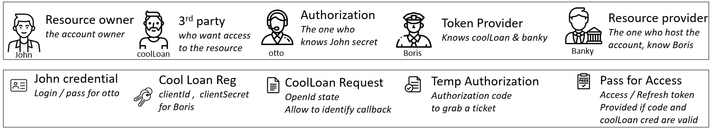

# Authorization CodeFlow

## Context , usage , purpose 


### Scenario 


> The challenges , is how do I to grant access to a 3rd party to my data owned.

here is one solution 


Here as John gives its credential to PirateLoan , PirateLoan has then full access to his bank, it s definitely not a good solution. 

Topic is now to be able to share an 'scoped' access to a specified 3rd party , in a secure maner. 
Authorization code flow solves this by introducing a trust and authorization party. 


> Solution is based on bi mutual trust : 
> * End user must have access to the data owner (here bank)  via a secret (login / password ) 
> * 3rd party (here coolLoan ) must be registered to data owner (bank) via a client id / secret for a given scope  
> * End user knows both party bank and cool loan and allows exchange of information for a given scope for doing that he must be known (ie logged)

Notice that most of the time the *identity provider* and the *provider 

### Mapping with OpenIdConnect Authorization Code flow.  


In the last comics here is a mapping with the openID connect concept


* John is the resource owner : he is the one who owned the resource here an account . He uses a *User agent*
* CoolLoan is the 3rd party called the *Client*.
* CoolLan has pre registered an *application* in popBank. it is about a *clientId* (public), a *clientSecret* as well as a *redirect url* 
* Otto and Boris reprents the  *Authorization Server*, Otto validate users , he is the  *Identity server* (IdP) that allows John to authenticate himself , and grant permission. 
* Boris is the *Access Token provider*. It need to know Otto. Most of the time they are part of PopBank, but can be delegated (for instance login with google)
* During step 1, CoolLoan is providing a *state* , it s a temporary code that CoolLoan expect to get it back from the John to validate that it s a request coming from himself. this is not mandatory.
* During step 2&3 the User agent send the state + the callback URI + clientId . CallBack URI need to be the same as the registered one (notice that several can be registered). it is a weak identification of coolLoan.
* During step 4 Authorization will send back to John the state , as well with the a generated and temporary code. The code represents that the request identified by the state has been granted. the code has a short period of validatiy. 
* Another point key aspect is that it redirect to a coolLoan pre registered URL . So here there is trust between authorization server knows the user (John), and knows as well the Client (CoolLoan) , and John knows Cool Loan also. there is a trust chain. 
* Step 5 corresponds to the redirect following the uri. Client validate that the state is the one it sent at the beginning. Client will use the code to the token provider   
* During Step 6 , client presents his credential (clientId / Secret ) + *the code* . The code is beeing validating by the authorization server , as a previously agreed request in reply he get an access token + a refresh token
* When the access token validaty is outdated , it s too complex to grab another one as it is involving user interaction (login and password) . To avoid this situation a dedicated mechanism the refresh token with a longer life time allows you to grab a new access token. So we have Access token short lived that is present in all request , and from time to time we ask the refresh endpoint to get a new access token. The refresh token must be store securely. Once it s not possible to refresh, a user interaction is required. 

### Usage 

The Authorization code flow has to be used as soon as there is a user interaction, it s a B2C security model , where explicit user authentication and authorization (user consent ) is required . Notice than it s an Authorization pattern, not an Authentication one, nothing prescribe in the model how the end user authenticate himself to the identity provider.

The model can be applied as soon as a 3rd party in involved , but as well as when all is internal. Resource server beeing a core server, and the UI beeing developed internally but still with strong security model. 

A point of attention is that what is running on the user agent contains the clientId but must not contains the application secret. The exchange between the client and the authorization server are done via backend calls not browser. 

the details of the flow is defined in the [RFC6749 section 4.4](https://datatracker.ietf.org/doc/html/rfc6749#section-4.1)


## Flow Diagram 


[edit in plan UML](https://www.plantuml.com/plantuml/uml/TP91Jzm-4CNl_XHFEO7Ow7_utrPYHOfGHOMqAClsKbN8sCCc8jYfxK2tdxuJEzubM-5BRC_CRzwR-Ce7wSBmsWaXLR0EHKtU3auHrk-67Fx3DzkO0jAZNWlnP7-Zk34QMq-k43qNjwhjfGd0jleXmEio1b7jo8HuKVAAcwA8i4By5CGCXeaPud-dCuAt64FxKyArjTsTbOcIz5H3QAnh_yZGMeCDkRTJRMC6ClfMix0sx77lx5khoPss8Att4JzZFDWNCfaH3v_LFx4OFtSv8zK7ANdOIVI_86bUaX9UsmhbAZbPmezaEVFjwDT0Fk3CaMuTgR20wbgsUgiNyChsn9yW0-5SZ9HoDR7IgLnnWoKwksiDfpiY8-erTupNdWBuBavETgpbAAKVV8F1auCqup_p_jqwdQZ8zTVMUAx59eCFaKefwiFSNKs-7mjWdw6coiyqBv7z8bZUxreVYA-WPDSzIVK2N3144t-Y_IX-V5xBc78itzPtfwcSDigQiXjYsY70z_4LSEH-lNd0MPusyk0tn6u35XzRt2vIXmLsJfhm6FOzNSv-P8oVYyWk3ysbKkJzOuWTBvZuxCWtwPnbrfptzUO179cULJK3Vo7fo4sef1sYBbTZtNVPjPgT8H5hvDPOieV16OI6c9p0kMCUG9taJ6YSVV0sKygsvz8ddpWQDVG-Col45Hazl7P_0G00)

## Explanation 

### 1. request access 

**HTTP equivalent request**

> GET https://api.popbank.com/oauth/v2/authorization?response_type=code&client_id=myclient_id&redirect_uri=https://callback.coolLoan.com/auth/popbank/callback&state=foobar&scope=openid

> nb : is will be url encoded , ie : is %3A and / is %2F

Query parameters are : 
* response_type : must be equal to code, it indicates the flow models that begins
* client_id : is the application clientId that will be used for getting the access token afterward, it represents the what will be granted. 
* redirect_uri : the uri that will be used to send back the code. This uri must be pre registered for the clientId 
* scope : represent a subsection of what kind of data is required. 
* state : a temporary key, that will be sent back to identify the request, it is used to avoid Cross Site Request Forgery (CSRF or XSRF) 

more details about the parameters defines by openIDConnect [paragraph 3.1.2.1 Autentication Request](https://openid.net/specs/openid-connect-core-1_0.html#AuthRequest) 

### 2.   Users credentials and user consent screen 

as Oauth2/OpenId Connect is not an Authentication protocol this step is not prescribe. 

### 3. call back sent by the Authorization Server and receive by the userAgent as a response and redirected to the client. 

the URI sent back as a 302 (redirect) for the user agent. The location header contains beeing the callback_url with some parameter 

> HTTP/1.1 302 Found
> Location : https://callback.coolLoan.com/auth/popbank/callback?state=foobar&code=codeGeneratedByAuthServer

* state : the state provided during the initialisation of the call step 1. This allow to ensure the call received correspond to a request (kind of session) 
* code : generated by the authorization server, it represents the agreement and the identification of the end user. This code is valid for a short period of time. 

in case of error, the redirect will looks like this  
>   HTTP/1.1 302 Found
> Location: callback.coolLoan.com/auth/popbank/callback?error=invalid_request&error_description=Unsupported%20response_type%20value&state=foobar

the field error contains an error code as defines in the section [4.1.2.1 of OAuth 2.0](https://datatracker.ietf.org/doc/html/rfc6749#section-4.1.2.1) , in addition with those defines in [openID errors](https://openid.net/specs/openid-connect-core-1_0.html#AuthError)
    


### 4. request a token 

once the Client receive the callback , it can get an access token.

**HTTP equivalent request**

POST https://www.linkedin.com/oauth/v2/accessToken HTTP/1.1

Content-Type: application/x-www-form-urlencoded
grant_type=authorization_code
code=codeGeneratedByAuthServer
redirect_uri= https://callback.coolLoan.com/auth/popbank/callback
client_id=myClientId
client_secret=myClientSecret


* grant_type : is authorization_code , it indicates the flow in progress
* code : is the one generated by the authorization server, it represents the user consent , it will be validated by the token provider.
* client_id / client_secret : it identifies the clients (as same as in the client credential flow) 
* redirect_uri : has to be the same as the one provided during the generation of the code .

the reply would have the following form : 


> {
>  "access_token": "AQXNnd2kXITHELmWblJigbHEuoFdfRhOwGA0QNnumBI8X...",
>  
>  "expires_in": 300
>  "refresh_token": ""AQWAft_WjYZKwuWX..."
>  "refresh_token_expires_in": 525600
> }

* access_token : represents the ticket that you need to show at each request in the authorization header
* id_token : it s an addition to Oauth2, it reprepesents user identity and grant cf [OpenIdConnect] (https://openid.net/specs/openid-connect-core-1_0.html#IDToken)
* expires_in : represents in seconds ,  when the access token will expire . After the access token won't be valid 
* refresh token : a special token to be able to get a new access token 
* refresh_token_expires_in : represents in seconds when the refresh token will expire. After this delay a full re authentication will be required. Notice that this period should be longer than the access token expiration date. 


### refresh token 

POST https://www.linkedin.com/oauth/v2/accessToken

Content-Type: application/x-www-form-urlencoded
grant_type=refresh_token
&refresh_token=AQQOMeCIQMa6-zjU-oooo


the reply is a new access token, and the refresh token , notice than the expiration date is smaller 
> {
>  "access_token": "Newer...",
>  "expires_in": 300
>  "refresh_token": ""AQWAft_WjYZKwuWX..."
>  "refresh_token_expires_in": 525305
> }

## plan UML source code of the flow


```
@startuml

actor "Resource Owner / John" as RO

box "End User"
participant  UA[
    = User Agent
    ----
    ""John""
]
end box

participant 3rd[
    = 3rd party
    ----
    ""CoolLoan""
]

box "Authorization Server"
participant Auth [
    = Identity Provider
    ----
    ""eddy""
]

participant Token[
    = TokenProvider
    ----
    ""boris""
]
end box


participant R [
    = Resource Server
    ----
    ""banky""
]


UA -> Auth : send authorization request (redirect, clientId, scope, state )
Auth->Auth : 
Auth-->UA : login screen
RO-> UA : set credential
UA-> Auth : push user and password 
Auth -> UA : Consent Screen
RO -> UA : Accept
UA -> Auth : Response of consent 
Auth->Auth : 
Auth-->UA: redirect to registered callback  + code + state
UA->3rd : call redirect URL + code + state
3rd -> 3rd : check state
3rd-> Token : POST (clientId , clientSecret , redirect URI, code , grant_type authorization code)
Token--> 3rd : access_token + refresh_token
3rd -> R : GET ressource Authorization Bearer accessToken 
R->R : Validate token
R --> 3rd  :return the resource
3rd -> Token : Refresh access (grant_type=refresh_token  + refresh_token)
Token --> 3rd : new access_token

@enduml

```
