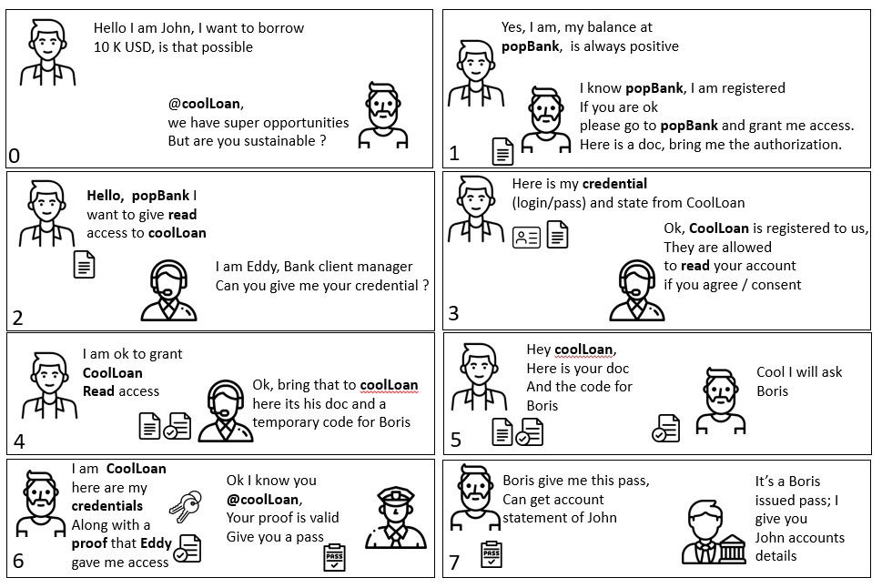

# Authorization CodeFlow

## Context , usage , purpose 

### Scenario 

> The challenges , is how do I to grant access to a 3rd party to my data owned.

here is one solution 

Here as John gives its credential to PirateLoan , PirateLoan has then full access to his bank, it s definitely not a good solution. 

Topic is now to be able to share an 'scoped' access to a specified 3rd party , in a secure maner. 
Authorization code flow solves this by introducing a trusted party . 

> Solution is based on bi mutual trust : 
> * End user must have access to the data owner (here bank)  via a secret (login / password ) 
> * 3rd party (here coolLoan ) must be registered to data owner (bank) via a client id / secret for a given scope  
> * End user knows both party bank and cool loan and allows exchange of information for a given scope for doing that he must be known (ie logged)

Notice that most of the time the *identity provider* and the *provider 

### Mapping with OpenIdConnect Authorization Code flow.  

### Usage 

[RFC6749 section 4.4](https://datatracker.ietf.org/doc/html/rfc6749#section-4.1)

## Flow Diagram 

[edit in plan UML](https://

## Explanation 

### 1. request token 

## plan UML source code of the flow

