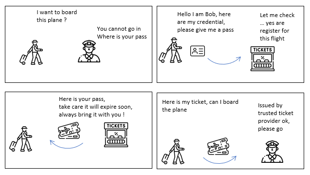

# Client Credential


## Context , usage , purpose 

### Scenario 



> In this scenario, a man wants to board a plane (the **ressource owner**) . He previously register himself to the company . He still cannot board, has no ticket (ie *access token* ) 

> he goes and presents his credential (*client_id*  , and *client_secret* can be his credit card) that validate who he is.

> The ticket provider checks if he is registered, and generate him a ticket (the *access_token* ) for a given set of destinations (*scope*) and for valid for a given period of time. if got expired the client has to grab back a new ticket. 

> The passenger need then to provides his tickets at each gates to move on.

> The ticket beeing checked , and validated by the security officer.

> **Notice**  that the security officer does not know anything about the credit card. but only that the ticket is valid. the ticket is anonymous, if someone stole the ticket he can board. More about Oauth2 security threat and mitigation can be found in the [RFC 6819](https://datatracker.ietf.org/doc/html/rfc6819)

### Usage 

Client credential flow is designed handling machine to machine communication. 
Client must be able have access securely to sensitive information such as the clientId and client secret 
those used to to store in a key vault. 

Client Credential flow is describe in this [RFC6749 section 4.4](https://datatracker.ietf.org/doc/html/rfc6749#section-4.4)

This flow does not suits for Web client, or mobile interaction as those sensitive credentials can be stolen. 


## Flow Diagram 


[edit in plan UML](https://www.plantuml.com/plantuml/png/TOzDImCn48Rl-HM31sdHjk2neBJav4dOYXVnC2O31lEn9XCF_dedsNQnYdFP3SdplFFk2cFc6hmQvUkC6p4oQ7XM87CBsZkAt0yhcVvp8QDUr1dnW9NVPcelXvJT5x9B4GwKFod_TgH6tAmBXj7JsgImISwQ3QTtYd_zm-mUg9IQ3VsZnT6jBJ8sOzT8J8erlCfJlRexBheLpKUbmh0tHeJms69XCTMzjt1zR0w5J2PUgedx8NX2xoI8O6OkJyoXCoT460tRyw0h2CG8mYCetRG3zANGjeAf5rnmUxjKmwIG-_dAfCYIf7OKRGt-6m00)


## Explanation 

### 1. request *Access token*  
1st request is done on the **token url**. This URL can be found as part of the OIDC discovery in the field 'token_url'. 
the discovery URL is available for an OIDC server against this [https://authorizationServer/**.well-known/openid-configuration**]() for instance here is the google one 
https://accounts.google.com/.well-known/openid-configuration 

the request must set 
   - grant_type : "client_credential"
   - scope : "openid" is recommended but not mandatory

clientId and client secret can be passed in 2 ways either as basic Oauth2 headers , either as body 

   - as Body : it must use the application/x-www-form-urlencoded Content-type , and set the payload with form encoding : grant_type=client_credentials&scope=clientId&client_id=openapi-cicd&client_secret=clientSecret

**curl command**

> curl --location --request POST 'https://oauth2.sample.com/oidc/token' \
> --header 'Content-Type: application/x-www-form-urlencoded' \
> --data-raw 'grant_type=client_credentials&client_id=myClientId&client_secret=myClientSecret'

**HTTP equivalent request**

> POST https://oauth2.sample.com/oidc/token
> 
> Header
> Content-Type: application/x-www-form-urlencoded
>
> Payload ( form encoded cf curl command ) 
> grant_type: "client_credentials"
> scope: "openid"
> client_id: "myClientId"
> client_secret: "myClientSecret"

### 2. validating and Issuing a token 

The authorization server validate the matching between clientId, client secret , grant type. The for the given client application if the requested scopes matches (or sub matches) the one declared during the creation of the client application. 

### 3. send the access token

The authorization server return a Json with the content at least below 

```
{
	"access_token": "a JWTAccess Token",
	"expires_in": 300,
	"token_type": "Bearer",
}
```

   - access_token : is mandatory; it is a JWT that will need to be presented for getting the resource
   - token_type : describe how to use the token most of the time is will be "Bearer" (cf [RFC6750](https://datatracker.ietf.org/doc/html/rfc6750) need to be passed as the Authorization header in subsequent call.
   - expires_in   : life time of the token express in second (not mandatory)  

the access token answer is describe in the [RFC6749 section 5.1](https://datatracker.ietf.org/doc/html/rfc6749#section-5.1)

### 4. Do API call with the access token

Client do the call to the resource server, providing the token issued by the Authorization server, leveraging the *token_type*

Most of time it would be using an *Authorization* Header and a Bearer token 

**curl command**
> curl --location --request POST 'https://api.data.com/' \
> --header 'Authorization: Bearer JWT token' \
> --header 'Content-Type: application/json' \
> --data-raw 'your payload'

### 5. Check and Return of API call

the ressource server need to check the presence and the validatiy of the *Access_token* presents in the *Authorization* Header 
Basic checks are : 

* issuer (field *iss* of JWT) : the issuer must be known from the backend end , usually handle as a configuration parameter 
* signature : once the issuer is checked, validatate that the signature is ok. For doing that use the *kid* field (public key identifier) of the JWT. Using the discovery endpoint *.well-known/openid-configuration*, leverage the *jwks_uri* that contains the JSON Web Key Set cf [RFC7517](https://datatracker.ietf.org/doc/html/rfc7517)
* expiration (field *iss* of JWT) : validate if the provided token is still valid 
* scope 
* ...


## plan UML source code of the flow

```
@startuml
participant C [
    = Client
    ----
    """"
]

participant Oauth [
    = Authorization Server
    ----
    ""oauth2.sample.com/oidc/token""
]

participant R [
    = Resource Server
    ----
    ""api.data.com""
]
autonumber
C-> Oauth : Request Access Token (ClientId , Client secret)
Oauth -> Oauth : Validate ClientId & Client Secret
Oauth --> C : Access Token + meta data 
C -> R  : Read Resource (token)
R--> C  : Resource content
@enduml

```

## Code library and sample

* Java Spring Security : https://www.baeldung.com/spring-webclient-oauth2 


