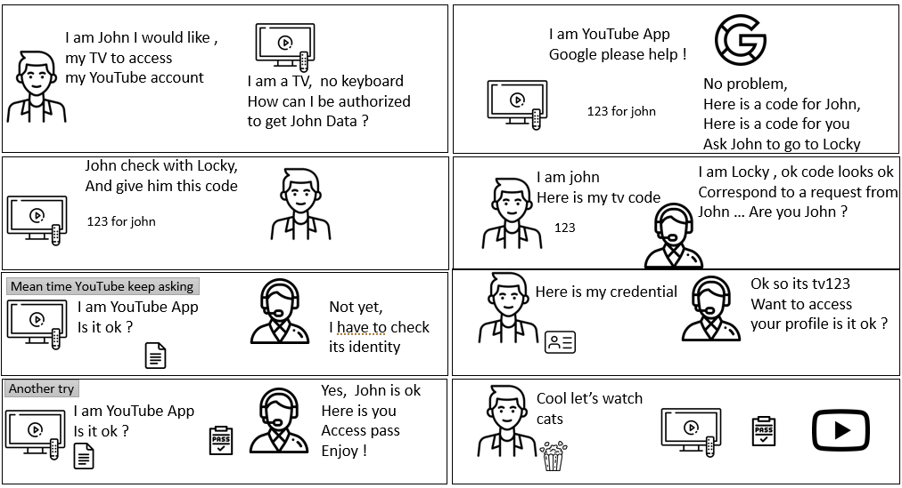

# Device code Flow

## Context , usage , purpose 


### Scenario 

> The challenges , is how do I to grant access to a application running on a device; knowing that this device do not provide smart user interface.

here is a typical scenario : 



An application Youtube will run on a device , a TV set. Youtube application need to access to your youtube profile online.
The way it s done is that the TV will display an authentication code , so that user can go on the web enter it , and then depending cookies and so on, would need to authenticate and grant consent for the application. In mean time the application will pool the token provider to get if the end user has acknowledge or not. 

### Usage 

Device code flow is used when it is required to have a end user authentication / authorization , but the device cannot perform it. Instead the device will delegate this authentication able to handle end user interaction.
With Device Flow, end users can authorize browserless or input constrained devices to access APIs

Typical exemple is smartTv application, IoT device such as watch , or printer. This protocole is also the one used by Azure CLI. 


## Flow Diagram 


[edit in plan UML](https://www.plantuml.com/plantuml/uml/XL8zRzim4DtvAnuqnQYD3jq2DAYGPaXRG85Q3qLH10nvjWdBf4fIZjrVtnCfoxOoL1F9Un_ldVqfHEbZjsk4a2ewZwAcu3gl2DMh9O_t-E8sje0Cg2iXNjm1nOFLM0RoXMYPR9HffOt0ilmbmD_7D4Iv9XlJmuA_T2YA95Q8tu9OWyN4bSG7hqyIbSLdsXj5KuMVhelT2q6sRMEKZCPbmHojxEB6UVCtlUCx-VqqPe_0oULHSqOJZtZoRcyq-Kit5hrY_d1RiWCpNzwoBffTa-lHSrnmJZVjTnpw1V9z_P3BrTNYZhU3MxJaLsu7QI5LNrBqpukx78ZdDVtfA4GefmatgZ7Sy55ZZg1SIpEHSGjcPBqRT6prtCFdq6dbmuN3cTMmukVEc_aiUp6rhfYfJMWRUOInA-TtUUCtenXc40nZyB84ezSEqU5mMDRV89Obg-IVuZIPkg6LQu98c4LM6ItJxAn-2-v8_boaDy3PO6MQ9WtlqunBNEohTQu15u3Ruiro7hpdIKjM6xkUP95XctZAsS3-a5OdGpuFDQvJC4X3UT8zG3O9Ft2JyYZyr1Ulleh_1XrZIgKeX0ny1qyhJs6JhbcZPiozv2MychYvGekQRRD82J_yC_y1)

## Explanation 

The device code flow is standardize with the [RFC8628](https://datatracker.ietf.org/doc/html/rfc8628)

### 1. request a Code 

curl -X POST https://acme-demo.auth0.com/oauth/device/code \
     -H "Content-Type: application/x-www-form-urlencoded" \
     -d "client_id=nZ8JDrV8Hklf3JumewRl2ke3ovPZn5Ho&audience=urn%3Amy-videos&scope=offline_access+openid+profile"


curl -d "client_id=client_id&scope=https%3A%2F%2Fwww.googleapis.com%2Fauth%2Fyoutube.readonly" \
     https://oauth2.googleapis.com/device/code
     
     
{
  "device_code": "ACodeForTheDevice",
  "user_code": "ACodeForTheUSer",
  "verification_uri": "https://bank.auth.com/device",
  "expires_in": 900,
  "interval": 5,
}

* device_code : REQUIRED.  The device verification code.
* user_code : REQUIRED.  The end-user verification code. A short string shown to the user that's used to identify the session on a secondary device.
* verification_uri :  REQUIRED.  The end-user verification URI on the authorizationserver.  The URI should be short and easy to remember as end users will be asked to manually type it into their user agent.

* expires_in : REQUIRED.  The lifetime in seconds of the "device_code" and "user_code".
 interval : OPTIONAL.  The minimum amount of time in seconds that the cliend  SHOULD wait between polling requests to the token endpoint.  If no value is provided, clients MUST use 5 as the default.

* verification_uri_complete : OPTIONAL.  A verification URI that includes the "user_code" (or other information with the same function as the "user_code"), which is designed for non-textual transmission.


  ### 1. User Authentication 
  
  ### 1. Device Polling
  curl -X POST https://acme-demo.auth0.com/oauth/token \
     -H "Content-Type: application/x-www-form-urlencoded" \
     -d "client_id=nZ8JDrV8Hklf3JumewRl2ke3ovPZn5Ho&device_code=L9dY-hNdxAdCXWh3rDDhwwuX&grant_type=urn%3Aietf%3Aparams%3Aoauth%3Agrant-type%3Adevice_code"

--
 POST https://login.microsoftonline.com/{tenant}/oauth2/v2.0/token
Content-Type: application/x-www-form-urlencoded

grant_type=urn:ietf:params:oauth:grant-type:device_code
&client_id=6731de76-14a6-49ae-97bc-6eba6914391e
&device_code=GMMhmHCXhWEzkobqIHGG_EnNYYsAkukHspeYUk9E8...

--
POST https://example.okta.com/token

grant_type=urn:ietf:params:oauth:grant-type:device_code
&client_id=https://www.oauth.com/playground/
&device_code=NGU5OWFiNjQ5YmQwNGY3YTdmZTEyNzQ3YzQ1YSA
---
POST /token HTTP/1.1
      Host: server.example.com
      Content-Type: application/x-www-form-urlencoded

      grant_type=urn%3Aietf%3Aparams%3Aoauth%3Agrant-type%3Adevice_code
      &device_code=GmRhmhcxhwAzkoEqiMEg_DnyEysNkuNhszIySk9eS
      &client_id=1406020730


Here is a result when the authorization process is not finished 
```
{
  "error": "authorization_pending",
  "error_description": "User has yet to authorize device code."
}

```

```
{
    "token_type": "Bearer",
    "scope": "User.Read profile openid email",
    "expires_in": 3599,
    "access_token": "eyJ0eXAiOiJKV1QiLCJhbGciOiJSUzI1NiIsIng1dCI6Ik5HVEZ2ZEstZnl0aEV1Q...",
    "refresh_token": "AwABAAAAvPM1KaPlrEqdFSBzjqfTGAMxZGUTdM0t4B4...",
    "id_token": "eyJ0eXAiOiJKV1QiLCJhbGciOiJub25lIn0.eyJhdWQiOiIyZDRkMTFhMi1mODE0LTQ2YTctOD..."
}
```     
  


     

## plan UML source code of the flow

```
@startuml

actor "Resource Owner / John" as RO

box "End User"
participant  UA[
    = User Agent
    ----
    ""John""
]
end box

participant 3rd[
    = On Device
    ----
    ""Youtube application""
]

box "Authorization Server"
participant Auth [
    = Identity Provider
    ----
  
]

participant Token[
    = TokenProvider
    ----

]
end box


participant R [
    = Resource Server
    ----
    ""youtube services""
]

RO->3rd : perfom an action
3rd -> Token : Request code (clientId , scope)
Token --> 3rd : ( user_code, device_code, verification_uri,)
3rd --> RO : display information (user_code ) 
RO -> UA  : go to xxURL 
UA--> Auth : go to verification_uri page 
Auth --> UA : display page
RO -> UA : enter user_code 
UA -> Auth : fill userCode 
3rd-> Token : pool for ok 
Token --> 3rd : Error pending
Auth --> UA : ask for consent and Authentication
UA -> Auth : send credential and consent
Auth--> UA : Page OK

3rd-> Token : pool for ok 
Token-> 3rd : accessToken + refreshToken
3rd->R : Call with accessToken 
R-->3rd : A resource
```
